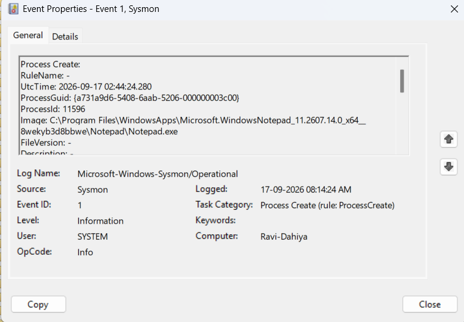
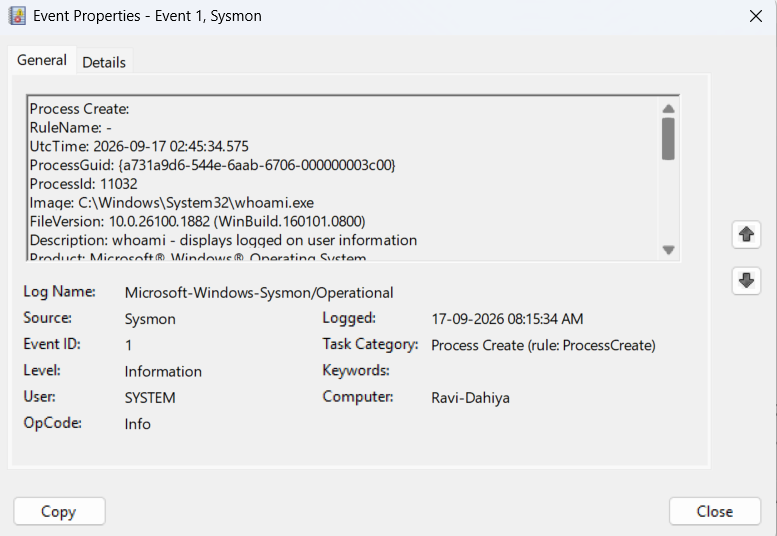

# Project 2: What Just Ran? Investigating Windows Processes with Sysmon

**Skills demonstrated:** Windows Event Logs, Event Viewer, Sysmon, process analysis,
command-line analysis, endpoint telemetry
**Environment:** Windows 11 (host), Sysmon v15.22, default configuration

## Objective

Understand how Windows records process creation activity, and learn to reconstruct
what happened on a system — who ran what, and what launched it — using only
Sysmon's Event ID 1 (Process Create) telemetry.

## Methodology

1. Installed Sysmon with the default configuration from an elevated Command Prompt:
   ```
   sysmon64 -accepteula -i
   ```
2. Confirmed the service installed and started successfully (`Sysmon64 started`).
3. Generated a handful of known, benign process events by:
   - Opening Notepad
   - Opening PowerShell and running `whoami`
4. Opened Event Viewer and navigated to:
   ```
   Applications and Services Logs > Microsoft > Windows > Sysmon > Operational
   ```
5. Used **Find** (Ctrl+F) to search for `notepad.exe` and `powershell.exe` to
   locate the exact Event ID 1 entries generated above, rather than scrolling
   through all 174+ events recorded during the session.

## Evidence

### Event 1 — Notepad Launch



| Field | Value |
|---|---|
| Image | `C:\Program Files\WindowsApps\Microsoft.WindowsNotepad_...\Notepad\Notepad.exe` |
| CommandLine | Same path, no arguments |
| User | `RAVI-DAHIYA\RAVI DAHIYA` |
| ParentImage | `C:\Windows\explorer.exe` |
| UtcTime | `2026-09-17 02:44:24.280` |

**Interpretation:** The parent process is `explorer.exe`, which is what launches
an application when a user opens it manually from the Start Menu or desktop —
not a script, not another program automating it. The `CommandLine` has no
extra arguments or flags, which is consistent with a normal, manual launch.
This is what a clean baseline looks like.

### Event 2 — whoami via PowerShell



| Field | Value |
|---|---|
| Image | `C:\Windows\System32\whoami.exe` |
| CommandLine | `"C:\windows\system32\whoami.exe"` |
| User | `RAVI-DAHIYA\RAVI DAHIYA` |
| ParentImage | `C:\Windows\System32\WindowsPowerShell\v1.0\powershell.exe` |
| ParentCommandLine | `"C:\Windows\System32\WindowsPowerShell\v1.0\powershell.exe"` |
| UtcTime | `2026-09-17 02:45:34.575` |

**Interpretation:** `whoami.exe` is a separate executable, so Sysmon records it
as its own process — but the `ParentImage` field shows it was spawned from
`powershell.exe`, confirming it was run as a command inside an interactive
PowerShell session rather than launched directly. This parent-child link is
exactly the kind of detail an analyst needs: seeing `whoami.exe` alone tells
you almost nothing, but seeing it as a child of `powershell.exe`, run by a
known user, with a clean command line, tells you it was routine interactive
activity — not, for example, a script silently reconnaissance-checking
privileges as part of an attack chain.

## Why These Fields Matter

- **Image / executable path** — confirms exactly which binary ran and from
  where. A legitimate-looking process name running from an unusual path
  (e.g. `powershell.exe` in a temp folder) is a red flag.
- **CommandLine** — arguments passed to a process often reveal intent. An
  empty or simple command line (as seen here) looks very different from an
  obfuscated or encoded PowerShell command line, which is a common attack
  technique.
- **User** — ties the activity to a specific account. Activity under an
  unexpected or privileged account is worth investigating.
- **ParentImage** — shows *what launched what*. This is often the strongest
  signal: `powershell.exe` spawned from `explorer.exe` (a user opening it) is
  routine; `powershell.exe` spawned from `winword.exe` (Word launching
  PowerShell) is a classic sign of a malicious macro.
- **Timestamp** — lets an analyst correlate this event with other activity
  happening around the same time, across processes or other log sources.

## Key Takeaway

Sysmon does not decide whether something is malicious — it simply records
detailed evidence. The value comes from an analyst's ability to read that
evidence in context: who ran it, what exactly was run, and what process
started it. The same alert (`powershell.exe executed`) can be completely
routine or highly suspicious depending on these surrounding details.
